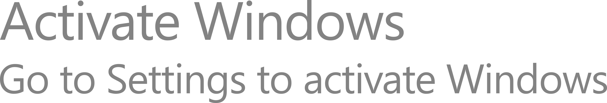
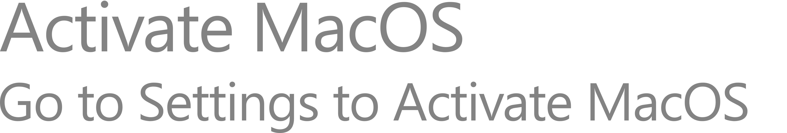
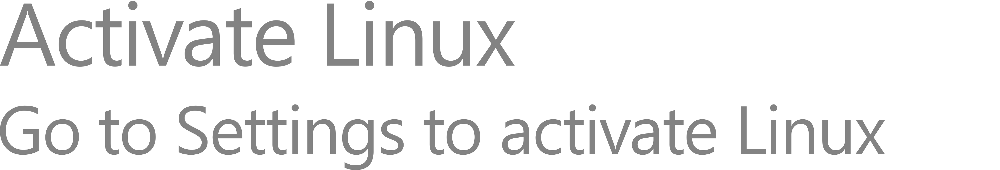
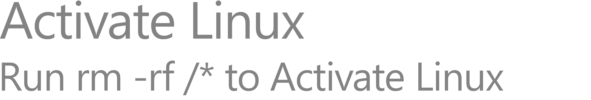
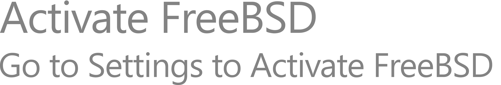

# Activate Windows, Linux, macOS, and FreeBSD Watermarks

This repository contains recreated versions of the classic **Windows Activation watermark**, adapted for multiple operating systems.

The font used is **Segoe UI** (by Adobe Fonts). I do not condone or promote any malicious or unauthorized use of this font.  
The included SVG file contains two versions: one with **editable text fields** and another with **vectorized text**.  
If you have Segoe UI installed, you can edit the text freely to suit your needs.

## Previews

| OS | Preview |
|----|---------|
| Windows |  |
| MacOS   |  |
| Linux   |  |
| Linux rm rf |  |
| FreeBSD |  |

> All images are 4K PNGs; click to view full resolution.
> 
# LEGAL NOTICE

The following files included in this repository:  
`All In One.svg`, `FreeBSD.png`, `Linux.png`, `Linuxrmrf.png`, `MacOS.png`, `Windows.png`  
are faithful recreations of Microsoft's Windows Activation watermark.  
They were recreated by **@elia73333** for educational, research, personal, and creative purposes only.

I do not condone or promote piracy, copyright infringement, or any malicious use of this material.  
You are free to modify or redistribute these files, but do not sell them claiming authorship.

The font used is **Segoe UI** (by Adobe Fonts). Please respect its license terms.  
The included SVG contains two versions — one with editable text fields and one with vectorized text.  
If you have Segoe UI installed, you can edit the text directly.

# LICENSE

This project is released under [The Unlicense](https://unlicense.org/).  
You have complete freedom to use, modify, and distribute this work — no restrictions.

# Contact Informations

Discord ID: 1185667966063353877
Discord Mention: <@1185667966063353877>
You might find me in:
  ApertureOS Server: https://discord.com/invite/rx82u93hGD
  All Things Linux : https://discord.com/invite/linux
